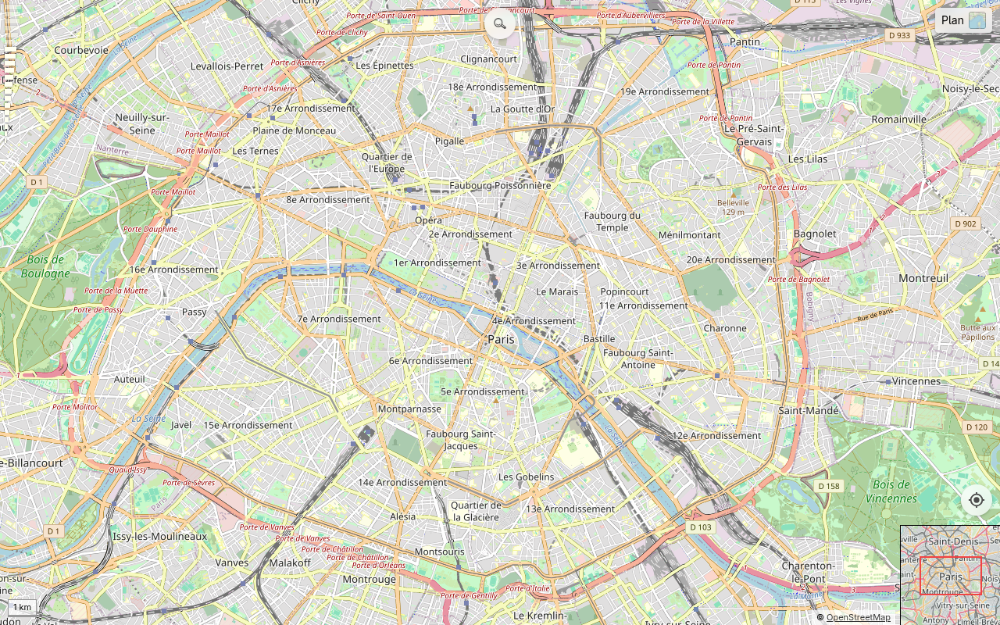

# Gheop Maps

Un clone de Google Maps ultra-léger : carte glissante en vanilla JS (zéro dépendance, aucun build), tuiles OpenStreetMap, et un petit proxy Go pour la recherche et les itinéraires. C'est la reprise modernisée d'un projet de 2009.

En ligne : **https://maps.gheop.com/**



Pour qui : ceux qui veulent une carte web qui démarre vite, tient dans un seul binaire et se déploie sans toolchain front.

## Fonctions

- 5 calques : Plan (OSM), Satellite (Esri), Relief (OpenTopoMap), Toner et Aquarelle (Stadia/Stamen)
- Recherche de lieu (Nominatim) et calcul d'itinéraire (OSRM)
- Géolocalisation
- Permalien `#calque/zoom/lat/lon` dans l'URL (calque inclus, donc partageable et conservé au rafraîchissement)
- Comblage des tuiles manquantes par la tuile parente dézoomée
- Minimap régionale, échelle, pyramide de zoom cliquable

## Installation

Prérequis : Go 1.23+.

```bash
go build -o maps .
./maps
```

Le binaire embarque tout le front (`//go:embed web`), donc rien d'autre à servir. Par défaut il écoute sur `:8080` ; surcharger avec la variable `PORT`.

```bash
PORT=3000 ./maps
```

## Utilisation

Ouvrir http://localhost:8080. Le front parle au proxy via deux routes :

- `GET /api/geocode?q=...` → recherche Nominatim (mise en cache)
- `GET /api/route?from=...&to=...` → itinéraire OSRM
- `GET /healthz` → sonde de vivacité

Les tuiles sont chargées directement depuis les fournisseurs côté navigateur. Stadia (Toner, Aquarelle) utilise l'auth par domaine (`*.gheop.com`), aucune clé n'est embarquée.

## Stack

- Front : ES modules vanilla, modèle de tuiles centré sur le viewport (coordonnées du centre en pixels monde), projection Web Mercator
- Back : `net/http` stdlib, cache LRU borné, image distroless statique
- Déploiement : k3s (voir `deploy/README.md`)

## Licence

MIT, voir [LICENSE](LICENSE).

## Changelog

### v1.1.0 — Comblage des tuiles et calque dans l'URL (2026-06-20)

- Le calque est inscrit dans le permalien (`#calque/zoom/lat/lon`) : il survit au rafraîchissement et part avec un lien copié. Les vieux liens `#zoom/lat/lon` restent valides (calque par défaut : Plan)
- Les tuiles absentes (204 du fournisseur, throttling) sont comblées par la tuile parente (zoom-1) mise à l'échelle, en fond CSS et de façon asynchrone, sans ralentir l'affichage du reste
- Aquarelle remonte à un zoom max de 15 (les trous en zone rurale sont comblés par la z14, complète)
- Correction d'une bordure noire autour des tuiles comblées sous Firefox (pixel transparent au lieu d'un `src` vidé)
- Vérification des zooms max par calque : Plan 19, Satellite 19, Relief 17, Toner 20, Aquarelle 15
- Au changement de calque, dézoom automatique sur le max du nouveau calque en gardant le centre

### v1.0.0 — Reprise moderne (2026-06-20)

- Réécriture du moteur de carte en vanilla JS, modèle centré sur le viewport (corrige le gris et la dérive au-delà du zoom 17)
- Proxy Go en binaire statique unique, front embarqué, cache des géocodages
- Recherche, calques, géolocalisation, itinéraire
- Barre de recherche repliable translucide, sélecteur de calques repliable avec vignettes, favicon carte + épingle
- Migration sur le k3s de gheop.com
